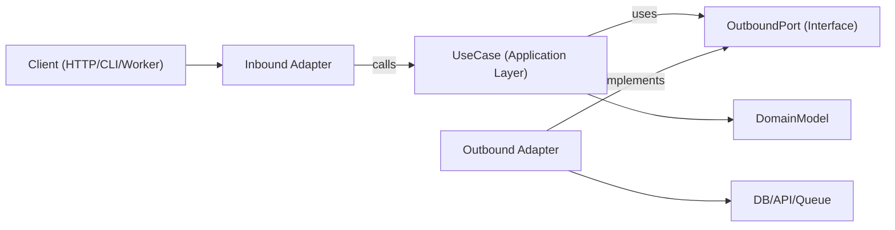

# Boundaries, Steps, Layout

## Core Concepts

- **Domain model**: Business rules and entities/value objects. No framework imports.
- **Use cases (application layer)**: Orchestrate domain behavior and workflow steps.
- **Inbound ports**: Contracts describing what the application can do (commands/queries/use-case interfaces).
- **Outbound ports**: Contracts for dependencies the application needs (repositories, gateways, event publishers, clock, UUID, etc.).
- **Adapters**: Infrastructure and delivery implementations of ports (HTTP controllers, DB repositories, queue consumers, SDK wrappers).
- **Composition root**: Single wiring location where concrete adapters are bound to use cases.

Outbound port interfaces usually live in the application layer (or in domain only when the abstraction is truly domain-level), while infrastructure adapters implement them.

Dependency direction is always inward:

- Adapters -> application/domain
- Application -> port interfaces (inbound/outbound contracts)
- Domain -> domain-only abstractions (no framework or infrastructure dependencies)
- Domain -> nothing external

## How It Works

### Step 1: Model a use case boundary

Define a single use case with a clear input and output DTO. Keep transport details (Express `req`, GraphQL `context`, job payload wrappers) outside this boundary.

### Step 2: Define outbound ports first

Identify every side effect as a port:

- persistence (`UserRepositoryPort`)
- external calls (`BillingGatewayPort`)
- cross-cutting (`LoggerPort`, `ClockPort`)

Ports should model capabilities, not technologies.

### Step 3: Implement the use case with pure orchestration

Use case class/function receives ports via constructor/arguments. It validates application-level invariants, coordinates domain rules, and returns plain data structures.

### Step 4: Build adapters at the edge

- Inbound adapter converts protocol input to use-case input.
- Outbound adapter maps app contracts to concrete APIs/ORM/query builders.
- Mapping stays in adapters, not inside use cases.

### Step 5: Wire everything in a composition root

Instantiate adapters, then inject them into use cases. Keep this wiring centralized to avoid hidden service-locator behavior.

### Step 6: Test per boundary

- Unit test use cases with fake ports.
- Integration test adapters with real infra dependencies.
- E2E test user-facing flows through inbound adapters.

## Architecture Diagram



## Suggested Module Layout

Use feature-first organization with explicit boundaries:

```text
src/
  features/
    orders/
      domain/
        Order.ts
        OrderPolicy.ts
      application/
        ports/
          inbound/
            CreateOrder.ts
          outbound/
            OrderRepositoryPort.ts
            PaymentGatewayPort.ts
        use-cases/
          CreateOrderUseCase.ts
      adapters/
        inbound/
          http/
            createOrderRoute.ts
        outbound/
          postgres/
            PostgresOrderRepository.ts
          stripe/
            StripePaymentGateway.ts
      composition/
        ordersContainer.ts
```
